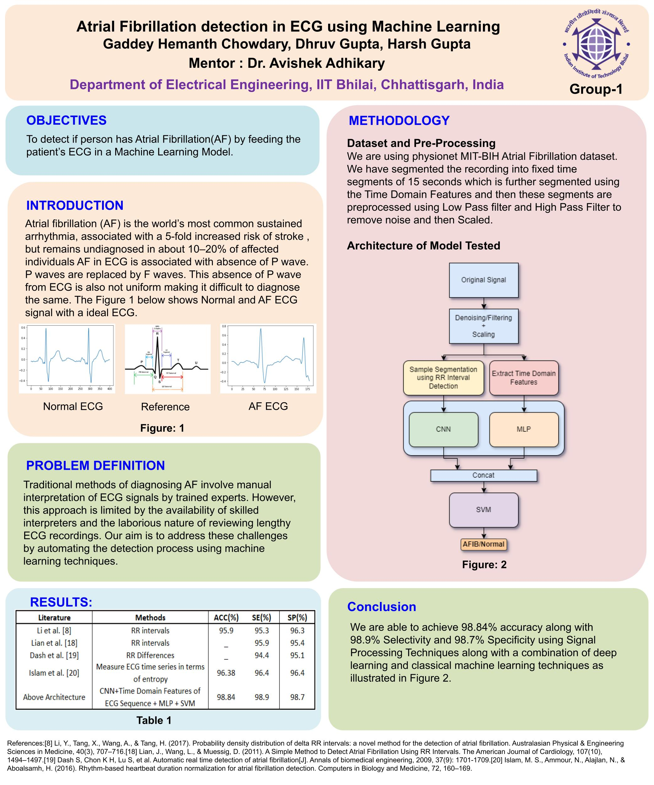

# Machine Learning-based Atrial Fibrillation Detection

## Authors
- Dhruv Gupta
- Hemanth Gaddey
- Harsh Gupta

## Abstract
Atrial fibrillation (AF) is a prevalent cardiovascular condition associated with a significantly increased risk of stroke. Manual interpretation of electrocardiogram (ECG) signals for AF diagnosis is labor-intensive and subject to variability. This project presents a method utilizing a combination of signal processing and machine learning techniques for automated AF detection. The approach integrates one-dimensional convolutional neural networks (CNNs) and time domain features of ECG sequences to detect AF with high accuracy.

## Introduction
Atrial fibrillation (AF) is a common and serious cardiovascular disorder, often associated with an increased risk of stroke. Despite its prevalence, AF diagnosis can be challenging due to the variability in ECG signals and the need for skilled interpreters. This project aims to develop an automated AF detection system using machine learning techniques to assist healthcare professionals in accurate and timely diagnosis.

## Dataset and Preprocessing
The Physionet MIT-BIH Atrial Fibrillation dataset is utilized for training and testing the proposed model. ECG recordings are segmented into fixed time segments of 15 seconds. Preprocessing involves:
- Noise reduction using low-pass and high-pass filters
- Scaling for normalization

## Model Architecture
The proposed model architecture combines deep learning with classical machine learning techniques. It consists of the following key components:
1. **Original Signal**: Raw ECG signals are input into the system.
2. **Denoising/Filtering + Scaling**: Noise reduction and normalization techniques are applied to prepare the data for analysis.
3. **Sample Segmentation using RR Interval Detection**: ECG signals are segmented into individual heartbeats using RR interval detection.
4. **1D CNNs for Feature Extraction**: One-dimensional convolutional neural networks are employed to automatically extract features from ECG signals.
5. **Time Domain Features Extraction**: Eight time-domain features are calculated based on RR intervals to capture key characteristics of ECG signals.
6. **Combination and Classification**: The output of the CNN and the extracted time domain features are combined into a feature vector, which is then fed into a support vector machine (SVM) classifier for AF detection.

## Results
The model achieves high accuracy in detecting atrial fibrillation, significantly aiding in timely and accurate diagnosis. Detailed results and performance metrics can be found in the results directory.